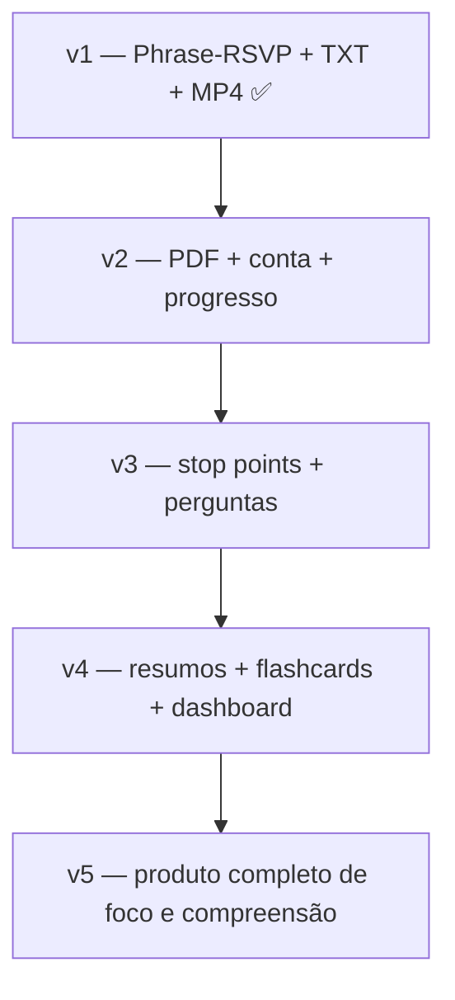

# PhraseFrame — próximos passos

Este documento define a evolução do produto a partir da **v1 hospedada**. A v1 provou o núcleo de leitura phrase-RSVP. As próximas versões transformam o app em uma **ferramenta de foco, compreensão e acompanhamento de leitura**.

---

## Visão do produto

PhraseFrame não é só um “speed reader”. É uma ferramenta que:

- mantém o olhar em **um ponto focal**;
- entrega o texto em **ritmo controlado**;
- ajuda o leitor a **entender e reter** o que leu;
- acompanha o progresso ao longo do tempo;
- transforma leitura passiva em leitura **ativa e interativa**.

> **Princípio central:** pacing com foco fixo, não leitura caótica.

---

## O que já existe (v1)

| Capacidade | Status |
|---|---|
| Leitura phrase-RSVP em uma linha | ✅ |
| Controle de velocidade e tamanho de frase | ✅ |
| Upload `.txt` / colar texto | ✅ |
| Exportação MP4 | ✅ |
| Base científica e UX de calibração | ✅ |
| Hospedagem (Render + Docker) | ✅ |
| Conta de usuário | ❌ |
| PDF | ❌ |
| Salvar progresso | ❌ |
| Perguntas / resumos / flashcards | ❌ |

---

## v2 — Ler PDF com conta e progresso

**Objetivo:** o usuário faz upload de um PDF, configura a velocidade e começa a ler de onde parou.

### Funcionalidades

1. **Upload de PDF**
   - Extrair texto com PyMuPDF (ou equivalente com revisão de licença).
   - Limpar cabeçalhos, rodapés, hifenização e números de página.
   - Detectar capítulos ou permitir seleção manual de intervalo.

2. **Configuração de leitura**
   - WPM, tamanho de frase, pausas em pontuação.
   - Modo “primeira passagem” vs “revisão”.

3. **Conta de usuário**
   - Login simples (email/senha ou OAuth).
   - Biblioteca pessoal de documentos.

4. **Persistência de progresso**
   - Salvar o PDF (ou referência segura ao arquivo).
   - Salvar frame/posição atual, WPM e configurações.
   - Retomar exatamente de onde parou em qualquer sessão.

### Entregáveis técnicos

- `DocumentExtractor` para PDF.
- Banco de dados (usuários, documentos, sessões de leitura).
- Storage para PDFs (S3/compatível ou disco persistente no host).
- API: `POST /documents`, `GET /documents/{id}/resume`.

### Critério de sucesso

Usuário sobe um PDF (ex.: *Think*), lê 10 minutos, fecha o app, volta no dia seguinte e continua no mesmo ponto.

---

## v3 — Compreensão ativa em stop points

**Objetivo:** ao fim de capítulo ou em pontos arbitrários, o app verifica o que o usuário entendeu.

### Stop points

Pontos de parada configuráveis:

- fim de capítulo (automático);
- a cada **X palavras** (ex.: 500, 1000);
- fim de seção detectada no PDF;
- parada manual do usuário.

### Perguntas de compreensão

Ao atingir um stop point:

1. Pausar a leitura.
2. Gerar 2–5 perguntas sobre o trecho lido.
3. Tipos de pergunta:
   - literal (o que foi dito?);
   - inferencial (o que isso implica?);
   - conexão (como se relaciona ao trecho anterior?).

### Feedback imediato

- Acerto/erro com explicação curta.
- Sugestão de voltar N frases se a compreensão cair.
- Ajuste opcional automático de WPM.

### Entregáveis técnicos

- Motor de stop points no `core/timing` ou serviço dedicado.
- Módulo `comprehension/` com geração de perguntas (LLM ou regras + LLM).
- UI de checkpoint entre sessões de leitura.
- Registro de desempenho por trecho.

### Critério de sucesso

Ao ler um capítulo, o usuário responde perguntas e o app identifica trechos mal compreendidos.

---

## v4 — Resumos, lacunas e flashcards

**Objetivo:** transformar falhas de compreensão em material de revisão.

### Quando o usuário erra ou demonstra dúvida

O app gera:

1. **Resumo do trecho** — 3–5 frases do que foi lido.
2. **Mapa de lacunas** — o que não ficou claro e por quê.
3. **Flashcards** — pergunta/resposta para revisão espaçada.

### Acompanhamento longitudinal

Dashboard pessoal com:

- livros em progresso;
- capítulos concluídos;
- taxa de compreensão por capítulo;
- flashcards pendentes;
- velocidade média sustentada com boa retenção.

### Entregáveis técnicos

- `review/` service: resumos, flashcards, fila de revisão.
- Modelo de dados: `ComprehensionResult`, `Flashcard`, `ReadingSession`.
- Tela “Revisar” separada da tela “Ler”.
- Algoritmo simples de repetição espaçada (SM-2 ou similar).

### Critério de sucesso

Usuário termina um capítulo difícil, recebe 5 flashcards, revisa no dia seguinte e melhora a compreensão no próximo checkpoint.

---

## v5 — Ferramenta completa de foco e leitura dinâmica

**Objetivo:** produto comercial com acompanhamento integral.

### Experiência alvo

```
Upload PDF → configurar pacing → ler com foco fixo
     ↓
Stop point → perguntas → identificar lacunas
     ↓
Resumo + flashcards → revisão → retomar leitura
     ↓
Dashboard de progresso e foco ao longo do tempo
```

### Diferenciais de produto

| Diferencial | Descrição |
|---|---|
| Foco fixo | Olho não salta pela página; frases chegam ao centro |
| Pacing inteligente | Pausas em pontuação, palavras difíceis, stop points |
| Leitura ativa | Perguntas forçam processamento, não só decodificação |
| Memória | Flashcards e resumos consolidam entendimento |
| Continuidade | Conta salva PDF + posição + histórico |
| Honestidade científica | Não promete 500 WPM com compreensão plena |

---

## Roadmap resumido



| Versão | Foco | Prioridade |
|---|---|---|
| v1 | Provar leitura phrase-RSVP | ✅ Concluída |
| v2 | PDF + persistência | Alta |
| v3 | Compreensão ativa | Alta |
| v4 | Revisão e retenção | Média |
| v5 | Produto comercial | Média |

---

## Decisões técnicas recomendadas

### Backend

- Manter `core` puro e determinístico.
- Adicionar `adapters/pdf.py` sem acoplar ao FastAPI.
- PostgreSQL para usuários, documentos, sessões, flashcards.
- Storage S3-compatible para PDFs.

### IA (v3+)

- LLM para geração de perguntas, resumos e flashcards.
- Prompt com o trecho lido + metadados (capítulo, posição).
- Cache por trecho para evitar regerar a cada reload.
- Nunca logar conteúdo do documento em produção.

### Privacidade

- PDFs privados por usuário.
- Criptografia em repouso no storage.
- Política de retenção clara.
- Opção futura: processamento local (desktop) para leitores que não querem upload.

### Hospedagem (pós-v1)

- Render Free: suficiente para demo.
- Render Starter / Fly.io / VPS: necessário para PDF + DB + storage.
- Jobs em background para extração de PDF e geração de perguntas.

---

## Métricas de sucesso (produto)

Medir **retenção e compreensão**, não só velocidade:

| Métrica | O que indica |
|---|---|
| Sessões completadas | Engajamento |
| Taxa de acerto nos checkpoints | Compreensão real |
| WPM sustentado com >70% acerto | Pacing ideal |
| Flashcards revisados | Consolidação |
| Retomada de leitura (D+1, D+7) | Hábito e valor |
| Capítulos concluídos por livro | Progresso tangível |

---

## Caso de uso norte: ler *Think* de Simon Blackburn

1. Upload do PDF local do usuário.
2. Seleção de capítulo (ex.: “What is philosophy?”).
3. Leitura a 280 WPM com frases de 4 palavras.
4. Stop point a cada 800 palavras → 3 perguntas.
5. Erros geram resumo + 4 flashcards.
6. Usuário revisa flashcards no dia seguinte.
7. Retoma do ponto exato no capítulo seguinte.

---

## Próxima ação imediata (v2 kickoff)

1. Implementar `adapters/pdf.py` com PyMuPDF.
2. Adicionar modelo de dados mínimo: `User`, `Document`, `ReadingProgress`.
3. Escolher auth (Supabase Auth, Auth0, ou FastAPI + JWT simples).
4. Tela de upload PDF com preview de capítulos.
5. Botão “Continuar de onde parei”.

Ver também: [V1.md](V1.md) · [ROADMAP.md](ROADMAP.md) · [SCIENCE.md](SCIENCE.md)
