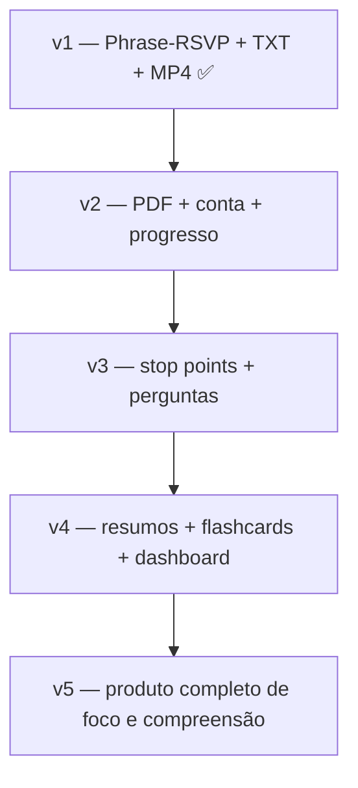

# PhraseFrame — próximos passos

Este documento define a evolução do produto a partir da **v1 hospedada**. A v1 provou o núcleo de leitura phrase-RSVP. As próximas versões transformam o app em uma **ferramenta de foco, compreensão e acompanhamento de leitura**.

---

## Visão do produto

PhraseFrame não é só um “speed reader”. É uma ferramenta que:

- mantém o olhar em **um ponto focal**;
- entrega o texto em **ritmo controlado**;
- ajuda o leitor a **entender e reter** o que leu;
- acompanha o progresso ao longo do tempo;
- transforma leitura passiva em leitura **ativa e interativa**.

> **Princípio central:** pacing com foco fixo, não leitura caótica.

---

## O que já existe

| Capacidade | Status |
|---|---|
| Leitura phrase-RSVP em uma linha | ✅ |
| Controle de velocidade e tamanho de frase | ✅ |
| Upload `.txt` / colar texto | ✅ |
| Exportação MP4 | ✅ |
| Base científica e UX de calibração | ✅ |
| Hospedagem (Render + Docker) | ✅ v1 |
| Conta de usuário | ✅ v2 |
| PDF | ✅ v2 |
| Salvar progresso / retomar leitura | ✅ v2 |
| Stop points + checkpoints de compreensão | ✅ v3 |
| Self-score + feedback + weak-passage flag | ✅ v3 |
| Perguntas template variáveis (2–5) | ✅ v3 local |
| Resumo extractivo + até 4 flashcards | ✅ v4 local |
| Attention Loop + Recall Moment persistente | ✅ demo local |
| Dashboard mínimo + SM-2 + tela Review cross-documento | ✅ v4 local |
| Return to passage (card → frame de origem) | ✅ v4 local |
| Perguntas/resumos por LLM + dashboard longitudinal completo | ❌ v4+ |

O fluxo local agora fecha o ciclo completo: **Read → Check → Gaps → Cards → Review → Return to
passage**. O Recall Moment mantém score, resumo, lacunas e ações na tela até uma decisão explícita;
cards novos entram imediatamente na fila, sem duplicar quando o mesmo checkpoint é respondido de
novo. O E2E no Render Starter continua pendente.

---

## v2 — Ler PDF com conta e progresso ✅

**Status:** concluída localmente (refatorada para payloads enxutos e um único endpoint de progresso).

**Objetivo:** o usuário faz upload de um PDF, configura a velocidade e começa a ler de onde parou.

### Entregue

- Upload de PDF com metadados de capítulo (texto sob demanda por capítulo).
- Conta email/senha + biblioteca pessoal.
- `PUT /api/documents/{id}/progress` como único caminho de persistência.
- `GET /api/documents/{id}/resume` restaura capítulo, frame, WPM e phrase size.
- SQLite + armazenamento em disco (`PHRASEFRAME_DATA_DIR`).

### Critério de sucesso

Usuário sobe um PDF (ex.: *Think*), lê 10 minutos, fecha o app, volta no dia seguinte e continua no mesmo ponto.

---

## v3 — Compreensão ativa em stop points ✅

**Status:** concluída localmente — stop points, 2–5 perguntas template, self-score, feedback e flag de trecho fraco.

**Objetivo:** ao fim de capítulo ou a cada N palavras, o app verifica o que o usuário entendeu.

### Entregue

- `stop_every_words` em `ReadingSettings` + `stop_frames` na timeline.
- `stop_every_words` persistido em `reading_progress` (restaurado no Continue).
- `POST /api/documents/{id}/checkpoints` — snippet gerado no servidor a partir do capítulo em cache.
- Self-score (Sure / Unsure / No idea) + feedback imediato + ajuste sugerido de WPM.
- `GET /api/documents/{id}/checkpoints` — histórico de scores por frame.
- `comprehension_rate` na biblioteca (média de scores).
- Geração variável de 2–5 perguntas template conforme o tamanho do trecho.

### Critério de sucesso

Ao ler um capítulo, o usuário responde perguntas, vê feedback, e trechos fracos aparecem no painel **Weak stops** ao retomar (com atalho “Jump to frame”).

---

## v3 — detalhes de produto (referência)

**Objetivo:** ao fim de capítulo ou em pontos arbitrários, o app verifica o que o usuário entendeu.

### Stop points

Pontos de parada configuráveis:

- fim de capítulo (automático);
- a cada **X palavras** (ex.: 500, 1000);
- fim de seção detectada no PDF — **não implementado** (stop manual + a cada N palavras);
- parada manual do usuário.

### Perguntas de compreensão

Ao atingir um stop point:

1. Pausar a leitura.
2. Gerar 2–5 perguntas sobre o trecho lido.
3. Tipos de pergunta:
   - literal (o que foi dito?);
   - inferencial (o que isso implica?);
   - conexão (como se relaciona ao trecho anterior?).

### Feedback imediato

- Self-score (Sure / Unsure / No idea) com feedback imediato — **sem** grading certo/errado automático.
- Sugestão de voltar N frases se a compreensão cair.
- Ajuste sugerido de WPM via feedback — **sem** ajuste automático silencioso.

### Entregáveis técnicos (referência histórica)

- Stop points e UI de checkpoint na pausa automática (feito).
- Feedback imediato e ajuste de WPM (feito via self-score).
- Geração LLM — **deferida**; templates + self-score provam o loop.

### Critério de sucesso (referência)

Ao ler um capítulo, o usuário responde perguntas e o app identifica trechos mal compreendidos.

---

## v4 — Resumos, lacunas e flashcards (entregue localmente) 🔄

**Status:** fluxo local construído — Recall Moment, resumo extractivo, lacunas, até 4 flashcards
imediatos por checkpoint fraco, SM-2, dashboard mínimo, tela **Review** cross-documento e retorno
ao frame de origem. O resumo gerativo e o dashboard longitudinal completo continuam pendentes.

**Objetivo:** transformar falhas de compreensão em material de revisão.

### Quando o usuário erra ou demonstra dúvida

O app gera:

1. **Recap extractivo do trecho** — até ~3 frases do que foi lido (não 3–5 garantidas; não generativo).
2. **Mapa de lacunas** — o que não ficou claro e por quê.
3. **Flashcards** — pergunta/resposta para revisão espaçada.

### Acompanhamento longitudinal

Dashboard pessoal com:

- livros em progresso;
- capítulos concluídos;
- taxa de compreensão por capítulo;
- flashcards pendentes;
- velocidade média sustentada com boa retenção.

### Entregáveis técnicos

- Serviço `review`: resumo extractivo, até 4 flashcards e fila cross-documento.
- Dashboard mínimo: pendências, compreensão média, paradas fracas e última leitura.
- Tela “Review” separada da tela “Read”.
- Agendamento de repetição espaçada SM-2.
- Primeira revisão imediata; grades seguintes seguem o intervalo SM-2.
- Card ligado ao checkpoint e ao frame de origem, com **Return to passage**.

### Critério de sucesso

Usuário identifica uma lacuna, revisa o primeiro card imediatamente e volta ao trecho de origem.
As revisões seguintes usam o agendamento SM-2.

---

## v5 — Ferramenta completa de foco e leitura dinâmica

**Objetivo:** produto comercial com acompanhamento integral.

### Experiência alvo

```
Upload PDF → configurar pacing → ler com foco fixo
     ↓
Stop point → perguntas → identificar lacunas
     ↓
Resumo + flashcards → revisão → retomar leitura
     ↓
Dashboard de progresso e foco ao longo do tempo
```

### Diferenciais de produto

| Diferencial | Descrição |
|---|---|
| Foco fixo | Olho não salta pela página; frases chegam ao centro |
| Pacing inteligente | Pausas em pontuação, palavras difíceis, stop points |
| Leitura ativa | Perguntas forçam processamento, não só decodificação |
| Memória | Flashcards e resumos consolidam entendimento |
| Continuidade | Conta salva PDF + posição + histórico |
| Honestidade científica | Não promete 500 WPM com compreensão plena |

---

## Roadmap resumido



| Versão | Foco | Prioridade |
|---|---|---|
| v1 | Provar leitura phrase-RSVP | ✅ Concluída |
| v2 | PDF + persistência | ✅ Concluída |
| v3 | Compreensão ativa | ✅ Concluída localmente |
| v4 | Revisão e retenção | 🔄 Fluxo principal construído localmente |
| v5 | Produto comercial | Média |

---

## Decisões técnicas recomendadas

### Backend

- Manter `core` puro e determinístico.
- Adicionar `adapters/pdf.py` sem acoplar ao FastAPI.
- PostgreSQL para usuários, documentos, sessões, flashcards.
- Storage S3-compatible para PDFs.

### IA (v3+)

- LLM para geração de perguntas, resumos e flashcards.
- Prompt com o trecho lido + metadados (capítulo, posição).
- Cache por trecho para evitar regerar a cada reload.
- Nunca logar conteúdo do documento em produção.

### Privacidade

- PDFs privados por usuário.
- Criptografia em repouso no storage.
- Política de retenção clara.
- Opção futura: processamento local (desktop) para leitores que não querem upload.

### Hospedagem (pós-v1)

- Render Free: suficiente para demo.
- Render Starter / Fly.io / VPS: necessário para PDF + DB + storage.
- Jobs em background para extração de PDF e geração de perguntas.

---

## Métricas de sucesso (produto)

Medir **retenção e compreensão**, não só velocidade:

| Métrica | O que indica |
|---|---|
| Sessões completadas | Engajamento |
| Taxa de acerto nos checkpoints | Compreensão real |
| WPM sustentado com >70% acerto | Pacing ideal |
| Flashcards revisados | Consolidação |
| Retomada de leitura (D+1, D+7) | Hábito e valor |
| Capítulos concluídos por livro | Progresso tangível |

---

## Caso de uso norte: ler *Think* de Simon Blackburn

1. Upload do PDF local do usuário.
2. Seleção de capítulo (ex.: “What is philosophy?”).
3. Leitura a 280 WPM com frases de 4 palavras.
4. Stop point configurável; usar 200 palavras na demo → 2–5 perguntas.
5. Erros geram resumo extractivo + até 4 flashcards.
6. Usuário faz a primeira revisão imediatamente; Got it / Again agenda as próximas.
7. Return to passage abre o frame fraco; Continue retoma o ponto salvo.

---

## Roteiro de demonstração para investidor (5 minutos)

1. Abrir `/?demo=1`, criar conta e subir um TXT curto ou PDF autorizado.
2. Manter o stop point padrão de **200 palavras**, preparar e iniciar a leitura.
3. Acionar **Check**, responder de memória e submeter uma vez.
4. Mostrar o **Recall Moment** persistente: score, limiar honesto de 67%, resumo extractivo,
   lacunas, quantidade de cards e marcador fraco.
5. Selecionar **Review now**, revelar, usar **Got it** ou **Again** e então **Return to passage**.
6. Encerrar no pulso da biblioteca: revisões devidas, recall médio, weak stops e última leitura.

As perguntas são templates, a confiança é autoavaliada e o resumo é extractivo. A demo não deve
ser descrita como “compreensão por IA” nem como leitura rápida sem custo cognitivo.

---

## Próxima ação imediata

1. Deploy v2/v3/v4 no Render Starter com disco persistente (`PHRASEFRAME_DATA_DIR=/data`) — **código pronto; E2E em produção pendente**.
2. O roteiro local completo foi validado em 2026-07-16, incluindo 390 px e console sem erros da aplicação.
3. Repetir no Render Starter: upload → checkpoint → Review → Return to passage → fechar → **Continue** no dia seguinte.
4. Executar o plano de UX/appeal (Phase Now): [UX_APPEAL_PLAN.md](UX_APPEAL_PLAN.md) + copy em [AI_UI_COPY_PACK.md](AI_UI_COPY_PACK.md) + claims em [AI_CLAIM_MATRIX.md](AI_CLAIM_MATRIX.md).

Ver também: [V1.md](V1.md) · [HOSTING.md](HOSTING.md) · [ROADMAP.md](ROADMAP.md) · [SCIENCE.md](SCIENCE.md) · [AI_BRIEF_UX_APPEAL.md](AI_BRIEF_UX_APPEAL.md)
